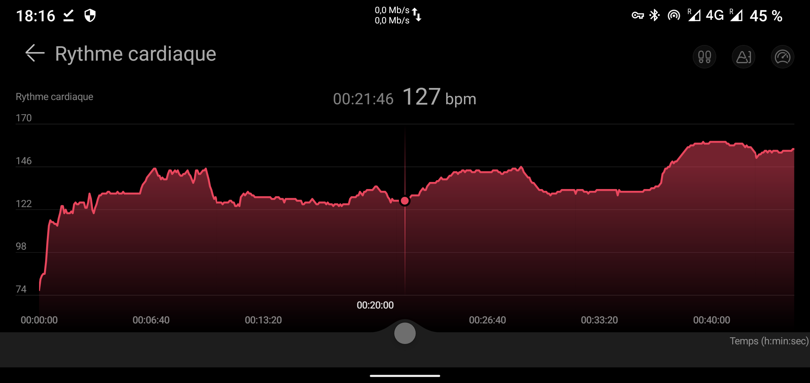
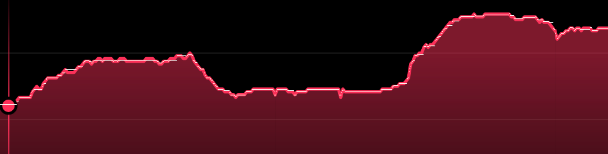

# huawei_sante

## Explanation

This little python software takes a screenshot, asks you for the min and max value of your heart curve and then takes the tcx file and adds your heart values.

## why?

Huawei heathl is not terrible in the export and poses a lot of problems. The idea is to have an application independent of huawei which dissects the graph exported by screenshot of the phone in order to have the heart data.

## limitation

The program does not take into account different screen copy resolutions.
The curve given by the copy is larger than the stroke.
There is therefore an interpolation to have the missing points.
This is not a problem because watches have a measurement delay and their measurements have a fairly large share of approximation.

The tcx files is ued for a importation in trainingpeaks. The tcx file is not complete because Trainingpeaks calculate the datas empty ;-)

> a good geek is a lazy geek

## Aplications

You have two littles scripts:
. createTCXFromGraph.py for create a tcx from copy of screen for importation in peak ()
. addHearthAtTcx.py for modify a tcx exported by Huawei Health and add heart data recognized from copy screen (use course.tcx and image.png of last file in /storage/emulated/0/Download/Tracks/Export for tcx and /storage/emulated/0/Pictures/Screenshots for png)

## Example of screen copy



After detection



## Android install

```bash
- use Termux
- pkg install root-repo
- pkg update
- apt install git
- git clone https://github.com/cadot-eu/huawei_sante
- cd huawei_sante
- apt install python-numpy
- pkg install libjpeg-turbo libcrypt ndk-sysroot clang zlib
- pip install pillow
- pip install glob2
```
### Cheat

You can make a shortcut by termux widget.
Create a file in .shortcuts/addTcxToHearth
```bash
cd huawei_sante
python addHearthAtTcx.py
mv nouveau.tcx /storage/emulated/0/Download/. #final exportation of tcx result
exit
```
